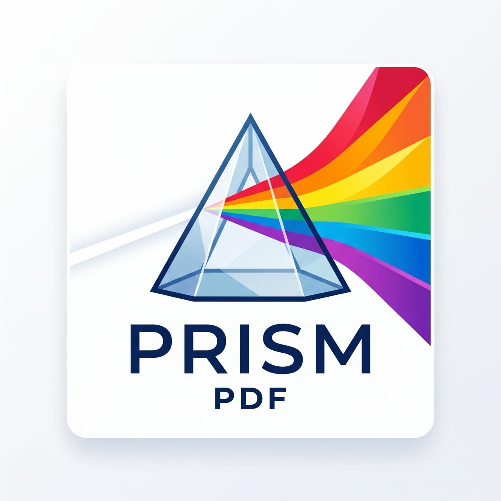

<div align="center">



### The pure-Rust PDF engine. Read it, reshape it, write it — every color of PDF.

[](https://github.com/theunloop/prism-pdf/actions/workflows/ci.yml)
[](https://github.com/theunloop/prism-pdf/actions/workflows/release.yml)
[](./LICENSE.md)

[Install](#install) · [Quickstart](#library-quickstart) · [CLI](#cli) ·
[Language bindings](#language-bindings) · [Architecture](#architecture)

</div>

---

**Prism PDF** is a complete PDF engine written in pure Rust: one library that **reads,
manipulates, and generates** PDFs, built FFI-first so every language ecosystem gets the same
engine — not a port. The parser is `#![forbid(unsafe_code)]`, and because real-world PDFs are
frequently malformed and always untrusted, automatic recovery and anti-DoS hardening are
first-class features, not afterthoughts.

## Why Prism PDF?

- 📖 **Reads anything.** Classic and stream cross-references, object streams, incremental
  updates — and automatic recovery when a file is broken. Extract text (with `/ToUnicode`,
  encoding fallback, and composite CID fonts), images, fonts, attachments, annotations, and form
  fields.
- ✂️ **Manipulates losslessly.** Merge, split, reorder, rotate, and incrementally update —
  unmodelled objects (annotations, outlines, structure trees) survive a round-trip untouched.
- 📝 **Generates beautifully.** A layout engine for text, tables, lists, images, headers/footers,
  and bookmarks; font embedding and subsetting; tagged (logically-structured) output; **PDF/A**
  (levels B and A) and **PDF/UA** (1 and 2) output validated by veraPDF in CI.
- 🔐 **Secures seriously.** Encryption (RC4 / AES-128 / AES-256, standard and public-key
  handlers) and digital signatures (detached CMS, signing time, visible appearance, PAdES-B chain
  validation, RFC 3161 timestamps).
- 🦀 **Safe by construction.** Pure Rust, a `#![forbid(unsafe_code)]` parser, fuzzing, and a
  conformance corpus — engineered for hostile input.
- 🌍 **One engine, every language.** A stable, handle-based C ABI designed from day one so
  idiomatic bindings share the same core — .NET ships today, more are on the way.

> Status: **0.4.1** is the latest release. The engine is feature-complete for reading,
> manipulating, generating, and signing PDFs. Page **rendering** (§10–§11) is out of scope for the
> v1 line. For what shipped, read [`CHANGELOG.md`](./CHANGELOG.md); what is still open is in
> [`ROADMAP.md`](./ROADMAP.md). The `0.x` API may change in minor releases; see
> [`RELEASING.md`](./RELEASING.md).

## Where to start

- **Rust applications** depend on the **`prismpdf`** facade crate — the single idiomatic import
  surface.
- **.NET applications** depend on the `PrismPdf` NuGet package; bindings for other languages are
  planned — see [Language bindings](#language-bindings) below.
- **C and C++ applications**, and anyone writing a new binding, consume **`pdf-ffi`** — the stable,
  handle-based C ABI (generated header `prismpdf.h`; contract in [`docs/ABI.md`](./docs/ABI.md)).
- **Shell users** run the **`prismpdf`** binary, built from `pdf-cli` — prebuilt for Windows,
  Linux and macOS on every release, see [CLI](#cli) below.
- The other `crates/*` are intentionally layered implementation crates behind these three entry
  points — see [Architecture](#architecture) below.

## Install

Prism PDF targets Rust **1.88+** (edition 2024). Depend on the facade crate `prismpdf`, which
re-exports the engine behind one import surface:

```toml
[dependencies]
prismpdf = { git = "https://github.com/theunloop/prism-pdf" }
```

Every crate is published under a `prismpdf-*` name — `pdf`, `pdf-cos`, `pdf-reader`, `pdf-writer`,
`pdf-content` and `pdf-cli` were already taken on crates.io by unrelated crates. Directory and
library names are unchanged, so `crates/pdf-cos` still builds the `pdf_cos` library; only the
facade's library follows its package, because `prismpdf` is what you type after `cargo add`.

## Library quickstart

```rust
use prismpdf::Document;

// Open a PDF (recovers automatically if the cross-reference is broken).
let doc = Document::open(std::fs::read("input.pdf")?)?;
println!("{} pages", doc.page_count()?);

// Extract text, faithfully decoded via each font's /ToUnicode where present.
println!("{}", prismpdf::document_text(&doc)?);

// Manipulate and save (full rewrite, or `save_incremental` / `save_compact`).
std::fs::write("output.pdf", doc.save()?)?;
# Ok::<(), prismpdf::DocError>(())
```

## CLI

The `prismpdf` binary exposes the engine from the shell. Every release attaches a prebuilt,
checksummed archive per platform, so no Rust toolchain is needed — one line installs it:

```bash
# macOS and Linux — detects your platform, verifies the SHA-256, installs to ~/.local/bin.
curl -fsSL https://raw.githubusercontent.com/theunloop/prism-pdf/main/scripts/install.sh | sh
```

```powershell
# Windows — same flow; installs to %LOCALAPPDATA%\Programs\prismpdf and updates your user PATH.
irm https://raw.githubusercontent.com/theunloop/prism-pdf/main/scripts/install.ps1 | iex
```

Pin a release with `PRISMPDF_VERSION=0.4.1`, or change the destination with
`PRISMPDF_INSTALL_DIR`. Prefer not to pipe a script into your shell? `cargo install prismpdf-cli`
builds from source (Rust 1.88+), or fetch an archive by hand:

<details>
<summary>Manual download (curl + checksum verification)</summary>

```bash
# Pick the archive matching your platform, verify it, run it.
VERSION=0.4.1; RID=linux-x64      # win-x64 | win-arm64 | win-x86 | linux-x64 | linux-arm64
                                  # linux-arm | linux-musl-x64 | linux-musl-arm64
                                  # osx-x64 | osx-arm64
BASE="https://github.com/theunloop/prism-pdf/releases/download/v${VERSION}"
curl -fsSLO "${BASE}/prismpdf-v${VERSION}-${RID}.tar.gz"
curl -fsSLO "${BASE}/SHA256SUMS-v${VERSION}.txt"
sha256sum --ignore-missing -c "SHA256SUMS-v${VERSION}.txt"
tar xzf "prismpdf-v${VERSION}-${RID}.tar.gz"
```

The `linux-musl-*` builds are statically linked and run on any distribution, Alpine included; the
`linux-x64`/`linux-arm64` builds target a glibc 2.17 floor (the installer picks the right one
automatically). Windows archives are `.zip`, the rest `.tar.gz`. macOS binaries are ad-hoc
signed, so a browser-downloaded first run still needs quarantine cleared
(`xattr -d com.apple.quarantine prismpdf`).

</details>

Commands:

```text
prismpdf <file.pdf>                       inspect (version, page count, metadata)
prismpdf text <file.pdf>                  extract text
prismpdf save <in> <out> [MODE]           rewrite/normalize (MODE = compact | packed | 1.4 … 2.0)
prismpdf merge <out> <in>...              concatenate PDFs
prismpdf images <in> <outdir>             extract images
prismpdf fonts <in> [outdir]              list (or dump) fonts
prismpdf attachments <in> [outdir]        list (or extract) embedded files
prismpdf annotations <in>                 list page annotations
prismpdf fields <in>                      list AcroForm fields + values
prismpdf fill <in> <out> name=value...    set form field values (incremental)
prismpdf flatten <in> <out>               bake form widgets into page content
prismpdf outline <in>                     print the bookmark tree
prismpdf xmp <in>                         print the XMP metadata packet
prismpdf sign <in> <out> <cert.der> <key.der>   digitally sign (§12.8)
prismpdf verify <in> [root.der...]        verify signatures (roots = trust anchors)
prismpdf subset <in> <out>                subset a PDF's embedded fonts
prismpdf subset-font <ttf> <out> <text>   subset a font to the glyphs in <text>
prismpdf encrypt <in> <out> [ALGORITHM]   encrypt (ALGORITHM = rc4 | aes128 | aes256; default aes128)
```

`prismpdf --help`, and `prismpdf help <command>`, document the same surface — they are generated from
the declaration that parses it.

Encrypted inputs read with the `PRISMPDF_PASSWORD` environment variable (tried as both user and owner
password).

## Language bindings

Each binding lives in its own repository and links against the C ABI, so it ships only what its
ecosystem needs and releases on its own cadence. **.NET is the only binding shipping today**; the
rest are planned and have no repository yet.

| Language | Status | Package | Build |
|----------|--------|---------|-------|
| .NET | Available — [`theunloop/prism-pdf-dotnet`](https://github.com/theunloop/prism-pdf-dotnet) | [](https://www.nuget.org/packages/PrismPdf) | [](https://github.com/theunloop/prism-pdf-dotnet/actions/workflows/ci.yml) |
| Python | WIP — planned | — | — |
| JavaScript / WASM | WIP — planned | — | — |
| Node.js | WIP — planned | — | — |
| Go | WIP — planned | — | — |
| Java / Kotlin | WIP — planned | — | — |
| Swift (Apple platforms) | WIP — planned | — | — |

A planned binding is a shape this repo's C ABI is designed to support, not work in progress with a
date. Every binding shares one object model and naming rules, so `doc.page_count` in Python,
`doc.pageCount` in JavaScript and `doc.PageCount` in C# are recognisably the same call, and each
ports the same conformance suite. Starting one — contributions welcome — is documented in
[`docs/BINDINGS.md`](./docs/BINDINGS.md), with the prebuilt native libraries it links against
described in [`docs/native-artifacts.md`](./docs/native-artifacts.md).

## Architecture

A Cargo workspace of small, single-responsibility crates with **one-way dependencies** (lower layers
never know about higher ones), so bindings link only what they need:

```
cos ← filters ← reader/writer ─┐
cos ← content ─────────────────┼→ document → layout / standards
cos ← crypto ──────────────────┘
cos + filters → graphics       cos + content → fonts
pdf (facade) → all of the above → pdf-ffi (C ABI) / pdf-cli (prismpdf)
```

- The idiomatic Rust API is the **`prismpdf`** facade crate.
- The stable, handle-based **C ABI** is **`pdf-ffi`** (cbindgen header `prismpdf.h`; contract in
  [`docs/ABI.md`](./docs/ABI.md)). Every [language binding](#language-bindings) consumes this
  surface from its own repository.

See [`DESIGN.md`](./DESIGN.md) for the full technical design and
[`docs/spec-map.md`](./docs/spec-map.md) for the index from ISO 32000 section number to the crate
that owns it. [`docs/README.md`](./docs/README.md) indexes the rest of `docs/`.

## Building & testing

```bash
cargo build --workspace
cargo test --workspace
cargo clippy --workspace --all-targets
cargo doc --workspace --no-deps
cargo bench -p prismpdf-document --bench document_operations
cargo bench -p prismpdf-layout --bench composition
```

The release-candidate measurement protocol and first recorded figures are in
[`docs/baselines/benchmark.md`](./docs/baselines/benchmark.md).

## Contributing & security

- Contributions: see [`CONTRIBUTING.md`](./CONTRIBUTING.md) and [`CODE_OF_CONDUCT.md`](./CODE_OF_CONDUCT.md).
- Releases & versioning policy: [`RELEASING.md`](./RELEASING.md).
- Security reports: see [`SECURITY.md`](./SECURITY.md) — please use private vulnerability reporting,
  not public issues.

## License

[MIT](./LICENSE.md) — © 2026 UNLOOP SRL.

Use it, modify it, embed it, redistribute it, and sell it, for any purpose and at any scale. The
one condition is that the copyright notice and permission notice in
[`LICENSE.md`](./LICENSE.md) travel with every copy or substantial portion of the Software.
Contributions are welcome under the same terms — see [`CONTRIBUTING.md`](./CONTRIBUTING.md).

Third-party components bundled or vendored here stay under their own licenses, recorded in
[`THIRD-PARTY-NOTICES.md`](./THIRD-PARTY-NOTICES.md).
